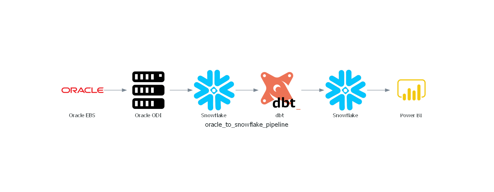

# 🚀 Oracle → Snowflake ETL Pipeline with dbt & Power BI

📄 This project automates the full ETL flow from Oracle EBS into Snowflake and delivers interactive reports via Power BI.

---

## 🧩 Architecture Overview

1. **Extract**  
   - Oracle EBS → ODI → raw staging schema in Snowflake  

2. **Transform**  
   - SQL-driven modeling, testing, and documentation with **dbt**

3. **Report**  
   - Interactive **Power BI** dashboards powered by transformed data

4. **Schedule**  
   - Fully managed using **dbt Cloud** / built-in scheduler  

---

## 🧩 Architecture Overview


## 🤔 Why This Setup

This pipeline was designed to meet core enterprise analytics needs through a combination of **Oracle ODI**, **Snowflake**, **dbt**, and **Power BI**:

---

### 1. 🎯 Target Database: ACID Compliance
- **Snowflake** ensures full **ACID** properties:  
  *Atomicity, Consistency, Isolation, and Durability*  
- Guarantees reliable transactions, even in high-concurrency or failure scenarios.

---

### 2. 🔄 Change Data Capture via Oracle ODI
- **Oracle Data Integrator (ODI)** provides robust CDC through **journalizing models**.
- Supports both **Simple** and **Consistent Set** capture.
- Tracks inserts, updates, and deletes in **Oracle EBS** using triggers or **LogMiner**.
- **Consistent Set CDC** ensures transactional integrity across related tables  
  *(e.g., orders and order lines)*.

---

### 3. 🧱 Data Partitioning & Incremental Loads
- **Snowflake** supports efficient partitioning via **clustering** and **micro-partitions**.
- **Streams & Tasks** support incremental strategies.
- ODI pushes incremental CDC data efficiently into Snowflake.

---

### 4. 🤝 Support & Community
- All components—**Oracle**, **ODI**, **Snowflake**, **dbt**, **Power BI**—  
  have robust vendor support and active developer communities.

---

### 5. 🛡️ Fault Tolerance & Recovery
- **Snowflake**:  
  - Time Travel  
  - Fail-safe
- **ODI**:  
  - High availability via clustered agents  
  - Logging of ETL steps
- **dbt / Power BI**:  
  - Retry logic  
  - Error visibility

---

### 6. 🔍 Data Lineage, Governance & Quality
- **dbt**:  
  - DAGs visualize model dependencies  
  - Built-in testing & documentation
- **Snowflake Enterprise Edition**:  
  - Built-in lineage tracking  
  - Integrates with governance tools

---

### 7. ⏱️ Scheduling & Dependency Management
- **ODI** handles extraction and CDC with its built-in scheduling engine.
- **dbt Cloud** scheduler manages model dependencies and SQL transformation logic.

---

### 8. 🔌 ETL Compatibility & API Access
- **ODI** integrates natively with Oracle EBS and Snowflake.
- **dbt** executes SQL models directly in Snowflake.
- **Power BI** refreshes data via the REST API.

---

### 9. 📈 Error Handling, Monitoring & Logging
- **ODI**:  
  - Logs every ETL step  
  - Monitored through its repository
- **Snowflake**:  
  - Query history  
  - Usage and error tracking
- **dbt**:  
  - Run logs for every job
- **Power BI**:  
  - API provides refresh result metadata

---

### 10. 🖥️ UI & Notifications
- **ODI Studio**: GUI for mapping, CDC configuration, and logging
- **dbt Cloud**: Web UI for job runs, documentation, lineage browsing
- **Power BI**:  
  - Dashboards with data refresh health  
  - Alerts and email notifications


---

### 📌 Key Components

| Layer               | Description                                         |
|---------------------|-----------------------------------------------------|
| **Oracle EBS**      | Source enterprise system                           |
| **ODI**             | Oracle Data Integrator for extract & load          |
| **Snowflake (Raw)** | Landing zone for raw/staging data                  |
| **dbt**             | Transformation layer – models, tests, docs         |
| **Power BI**        | Dashboards & reporting visuals                     |
| **Scheduler**       | dbt Cloud / job scheduler    |

---

### 🛠️ Tools Used

- **Oracle EBS** (source ERP)  
- **Oracle Data Integrator (ODI)**  
- **Snowflake** (data warehouse)  
- **dbt** (models, testing, documentation)  
- **Power BI** (dashboards & reports)  
- **dbt Cloud / Scheduler** (orchestration tool)

---

## 📂 Repository Structure

```
OracleToSnowflake/
├── dbt/
│   ├── analyses/
│   ├── macros/
│   ├── models/
│   │   ├── marts/
│   │   │   ├── dim_customer.sql
│   │   │   ├── dim_date.sql
│   │   │   ├── dim_item.sql
│   │   │   ├── fct_customer.sql
│   │   │   ├── fct_delivery_detail.sql
│   │   │   ├── fct_order_line.sql
│   │   │   └── fct_order.sql
│   │   ├── staging/
│   │   │   ├── ar_staging/
│   │   │   │   └── stg_ar_cash_receipts_all.sql
│   │   │   ├── ont_staging/
│   │   │   │   └── stg_oe_order_headers_all.sql  
│   │   │   └── wsh_staging/
│   │   │       └── stg_wsh_delivery_details.sql
│   │   └── sources/
│   │       └── sources.yml
│   ├── seeds/
│   ├── snapshots/
│   ├── tests/
│   ├── dbt_project.yml
│   └── README.md
├── scripts/
└── README.md

```
## 🧭 Pipeline Flow

1. **Oracle EBS → ODI → Snowflake (raw staging)**
   - Uses Oracle ODI Mapping to extract EBS Data
   - Writes to raw staging schemas in Snowflake

2. **dbt Modeling & Testing**
   - Staging models (`stg_…`) clean and standardize raw tables  
   - Mart models (`dim_…`, `fct_…`) build business-ready dimensions & facts  
   - Run `dbt test` to validate data quality  
   - Generate documentation & lineage with:
     ```bash
     dbt docs generate
     ```

3. **Power BI Reporting**
   - Power BI connects to Snowflake (Import or DirectQuery)  

4. **Orchestration: dbt Scheduler**
   - Schedule `dbt run && dbt test` using dbt Cloud or CLI cron  

## 🎯 Summary

This repo delivers a complete analytics pipeline:

- Oracle EBS data lands in Snowflake via ODI  
- dbt transforms and validates data into analytics-ready marts  
- Power BI dashboards refresh automatically  
- Scheduling is entirely managed via dbt Cloud — simple, maintainable, and robust

---


